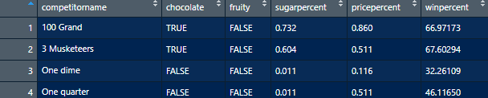
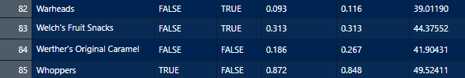
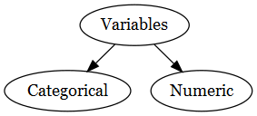

class: title-slide

```{r child = "../setup.Rmd"}
```

<br>
<br>
.right-panel[ 

# `r rmarkdown::metadata$title`
## `r rmarkdown::metadata$author`
]

---

class: middle

## Review

Quiz questions

---

class: middle

## Outline

- Introduction to Data

- Variables

- Describing Data with Numbers

- 

---

class: middle


## Data Frames 


```{r echo = FALSE, message=FALSE, warning=FALSE}
library(magrittr)
library(dplyr)
library(fivethirtyeight)
library(openintro)
library(tidyverse)
library(DiagrammeR)
library(DiagrammeRsvg)
library(rsvg)
library(janitor)

data(bad_drivers)
candy_rankings <- candy_rankings %>% 
  select(competitorname, chocolate, fruity, sugarpercent, pricepercent, winpercent)
```

Context: [Dear Mona, Which State Has the Worst Drivers?](https://fivethirtyeight.com/features/which-state-has-the-worst-drivers/)

---

class: middle

## Data Frame `bad_driver`  

```{r echo=FALSE, out.width='100%'}
knitr::include_graphics('img/data-matrix.png')
knitr::include_graphics('img/data-matrix-tail.png')
```

---

class: middle

## Data Frame `bad_driver`  

- The data frame has 8 __variables__ (`state`, `num_drivers`, `perc_speeding`, `perc_not_distracted`, `perc_no_previous`, `insurance_premiums`, `losses`). 

- The data frame has 51 __cases__. Each case represents a US state (or District of Columbia). 

---

class: inverse center middle

.font100[functions for data frames]

---

class: middle

```{r}
head(bad_drivers)
```

---

class: middle

```{r}
tail(bad_drivers)
```

---

class: middle

```{r}
glimpse(bad_drivers)
```

---

class: middle

```{r}
ncol(bad_drivers)
```

---

class: middle

```{r}
nrow(bad_drivers)
```

---

class: center  middle

## Getting to Know the Data Frame in Action

<video width="80%" height="45%%" align = "center" controls>
  <source src="screencast/01i-data-interface.mp4" type="video/mp4">
</video>

---

class: middle 

## Data Frame for You to Try Out `candy_rankings`

```{r echo=FALSE, out.width='100%'}


```

---

class: center middle

## Bob Ross

<iframe width="560" height="315" src="https://www.youtube.com/embed/zIbR5TAz2xQ" frameborder="0" allow="accelerometer; autoplay; encrypted-media; gyroscope; picture-in-picture" allowfullscreen></iframe>


---

class: middle

```{r}
glimpse(bob_ross)
```

---

class: middle

class: center middle 


##`candy_rankings` vs `bob_ross`

False - 0  
True - 1

---

class: middle


## Variables

```{r echo=FALSE, out.width='100%'}


```

---

class: middle

```{r echo = FALSE, fig.align='center'}
diagram_small <- grViz("
    digraph {
        # graph aesthetics
        graph [ranksep = 0.3]
        # node definitions with substituted label text
        1 [label = 'Variables']
        2 [label = 'Categorical']
        3 [label = 'Numeric']
        
        # edge definitions with the node IDs
        1 -> 2
        1 -> 3
    }
")
tmp <- capture.output(rsvg_png(charToRaw(export_svg(diagram_small)),'img/diagram_small.png'))
 
```

---

class: middle

## Variables

Variables `n_kids` (number of kids), `height`, and `winpercent` are __numerical variables__. 

--

We can do certain analyses using these variables such as finding an average `winpercent` or the maximum or minimum `winpercent`.

--

Not everything represented by numbers represents a numeric quantity. e.g. Student ID, cell phone number.

---

class: middle

## Variables

Variables such as `chocolate`, `fruity`, and `class_year` (first-year, sophomore, junior, senior) are __categorical variables__. 

--

Categorical variables have __levels__. For instance `chocolate` and `fruity` both have two levels as `TRUE` and `FALSE` and `class_year` have four levels.

---

class: middle

```{r}
glimpse(candy_rankings)
```

---

class: middle

```{r}
glimpse(mariokart)
```

---


class: middle

`character`: takes string values (e.g. a person's name, address)  
--

`integer`: integer (single precision)  
--

`double`: floating decimal (double precision)   
--

`numeric`: integer or double  
--

`factor`: categorical variables with different levels  
--

`logical`: TRUE (1), FALSE (0)  

---

class: inverse middle

As a data scientist it is .font30[**your**] job to check the type(s) of data that you are working with. Do .font30[**not**]  assume you will work with clean data frames, with clean names, labels, and types.


---

class: middle center inverse

.font75[Describing Data with Numbers]

---

class: middle

Categorical data are summarized with **counts** or **proportions**

---

class: middle

```{r echo = FALSE, message = FALSE}
lapd <- 
  read_csv(here::here("slides/data/Police_Payroll.csv")) %>% 
  janitor::clean_names() %>% 
  filter(year == 2018) %>% 
  select(job_class_title, 
         employment_type, 
         base_pay) %>% mutate(employment_type = as.factor(employment_type),
           job_class_title = as.factor(job_class_title),
           base_pay_level = case_when(
             base_pay < 0 ~ "Less than 0", 
             base_pay == 0 ~ "No Income",
             base_pay < 62474 & base_pay > 0 ~ "Less than Median, Greater than 0",
             base_pay > 62474 ~ "Greater than Median")) 
```


```{r}
glimpse(lapd)
```

---

class: middle

```{r}
count(lapd, employment_type)
```

---

class: middle

```{r}
tabyl(lapd, employment_type)
```


---

class: middle

```{r}
count(lapd, job_class_title)
```


---

class: middle

```{r}
count(lapd, job_class_title, sort = TRUE)
```

---
class: middle


## Summarizing Numerical Data

Consider the following data which represents the number of hours slept for 10 people who were surveyed.

.center[
<table>

<tr>

<td> 7 </td>
<td> 7.5 </td>
<td> 8 </td>
<td> 5.5 </td>
<td> 10 </td>
<td> 7.2 </td>
<td> 7 </td>
<td> 8 </td>
<td> 9 </td>
<td> 8 </td>


</tr>


</table>

]
---

class: middle

## Mean

$$\bar x = \frac{7+7.5+8+5.5+10+7.2+7+8+9+8}{10} = 7.72$$

The mean is calculated by summing the observed values and then dividing by the number of observations.

.formula[
$$\bar x = \frac{x_1 + x_2+.... x_n}{n}$$
]

where $\bar x$ represents the mean of observed values, $x_1$, $x_2$, ... $x_n$ represent the n observed values.

---

class: middle

## Median

If all the observations are listed from smallest to largest (or vice versa), the median is the observation that falls in the middle. 

.center[

<table>

<tr>

<td> 5.5 </td>
<td> 7 </td>
<td> 7 </td>
<td> 7.2 </td>
<td> 7.5 </td>
<td> 8 </td>
<td> 8 </td>
<td> 8 </td>
<td> 9 </td>
<td> 10 </td>


</tr>


</table>

]

In this case, we have two numbers in the middle 7.5 and 8. The average of these numbers would be the median. In this case, the median is 7.75. 

$$\frac{7.5 + 8}{2} = 7.75$$

--

Median is also the 50th percentile indicating that 50% of the data fall below this value.

---

class: middle

## Q1, Q3, and Interquartile Range

First quartile (Q1) is the point at which 25% of the data fall below of. 

Third quartile (Q3) is the point at which 75% of the data fall below of. 

Q1 and Q3 can be considered 25th and 75th percentiles respectively. 

.formula[Interquartile Range (IQR) = Q3 - Q1] which represents the middle 50% of the data.

---

class: middle


## In Pairs: Discuss

Consider Dr. Dogucu teaching three classes. 
All of these classes have 5 students. 
Below are exam results from these classes. 

Class 1: 80 80 80 80 80  
Class 2: 76 78 80 82 84  
Class 3: 60 70 80 90 100  

All of these classes have a mean of 80 points. 
Do you think the mean describes these classes well? 
Can you think of any other way to describe (in words not in numbers) how these classes differ?

---

class: middle center

#### Standard deviation and Variance


<table align = "center">
<thead>

<th>x<sub>i</sub> </th> <th>  x<sub>i</sub> - x&#772 </th> <th> (x<sub>i</sub> - x&#772) <sup>2</sup></th>
</thead>

<tr> 
<td>5.5 </td> <td> 5.5-7.72 = -2.22 hr</td> <td> (-2.2 hr)<sup>2</sup> = 4.9284 hr <sup>2</sup> </td>
</tr>

<tr> 
<td>7 </td> <td> 7-7.72 = -0.72 hr</td> <td> (-0.72 hr)<sup>2</sup> = 0.5184 hr <sup>2</sup></td>
</tr>

<tr> 
<td>7 </td> <td> 7-7.72 = -0.72 hr</td> <td> (-0.72 hr)<sup>2</sup> = 0.5184 hr <sup>2</sup></td>
</tr>

<tr> 
<td>7.2 </td> <td> 7.2-7.72 = -0.52 hr</td> <td> (-0.52 hr)<sup>2</sup> = 0.2704 hr <sup>2</sup></td>
</tr>

<tr> 
<td>7.5 </td> <td> 7.5-7.72 = -0.22 hr</td> <td> (-0.22 hr)<sup>2</sup> = 0.0484 hr <sup>2</sup></td>
</tr>

<tr> 
<td>8 </td> <td> 8-7.72 = 0.28 hr</td> <td> (0.28 hr)<sup>2</sup> = 0.0784 hr <sup>2</sup></td>
</tr>

<tr> 
<td>8 </td>  <td> 8-7.72 = 0.28 hr</td> <td> (0.28 hr)<sup>2</sup> = 0.0784 hr <sup>2</sup></td>
</tr>

<tr> 
<td>8 </td> <td> 8-7.72 = 0.28 hr</td> <td> (0.28 hr)<sup>2</sup> = 0.0784 hr <sup>2</sup></td>
</tr>

<tr> 
<td>9 </td> <td> 9-7.72 = 1.28 hr</td> <td> (1.28 hr)<sup>2</sup> = 1.6384 hr <sup>2</sup></td>
</tr>

<tr> 
<td>10 </td> <td> 10-7.72 = 2.28 hr</td> <td> (2.28 hr)<sup>2</sup> = 5.1984 hr <sup>2</sup></td>
</tr>

</table>


---

## Total distance from the mean


$\Sigma_{i = 1}^{n} (x_i - \bar x )^2 =$

$4.9284 + 0.5184 + 0.5184 + 0.2704 + 0.0484 +$ 
$0.0784 + 0.0784 + 0.0784+ 1.6384 + 5.1984 = 13.356 \text{ hr}^2$

Note that $n$ represents the number of observations which means $n = 10$.

---


## Sample variance

<br>    
.formula[

$$s^2 = \frac{\Sigma_{i = 1}^{n} (x_i - \bar x )^2}{n-1}$$ 

]

<br>

$$s^2= \frac{13.356}{10-1} = 1.484\text{ hr}^2$$

---

## Sample standard deviation

<br>
.formula[
$$s = \sqrt{\frac{\Sigma_{i = 1}^{n} (x_i - \bar x )^2}{n-1}}$$
]

<br>
$$s= \sqrt{1.484} = 1.218195 \text{ hr}$$


---
class: middle
## Mean

.pull-left[
```{r}
summarize(lapd, 
          mean(base_pay))
```
]

--

.pull-right[

```{r}
mean(lapd$base_pay)
```

]

---

class: middle
## Median

.pull-left[
```{r}
summarize(lapd, 
          median(base_pay))
```
]

--

.pull-right[

```{r}
median(lapd$base_pay)
```

]

---
class: middle

## Minimum

.pull-left[
```{r}
summarize(lapd, 
          min(base_pay))
```
]

--

.pull-right[

```{r}
min(lapd$base_pay)
```

]

--


.footnote[
In a similar fashion maxiumum can be found by using the `max()` function.
]

---

class: middle
## Standard deviation

.pull-left[
```{r}
summarize(lapd, 
          sd(base_pay))
```
]

--

.pull-right[

```{r}
sd(lapd$base_pay)
```

]

---

class: middle
## Variance

.pull-left[
```{r}
summarize(lapd, 
          var(base_pay))
```
]

--

.pull-right[

```{r}
var(lapd$base_pay)
```

]
---


class: middle center

## Quantiles / Percentiles / Quartiles

<style type="text/css">
.tg  {border-collapse:collapse;border-spacing:0;}
.tg td{border-color:black;border-style:solid;border-width:1px;font-family:Arial, sans-serif;font-size:14px;
  overflow:hidden;padding:10px 5px;word-break:normal;}
.tg th{border-color:black;border-style:solid;border-width:1px;font-family:Arial, sans-serif;font-size:14px;
  font-weight:normal;overflow:hidden;padding:10px 5px;word-break:normal;}
.tg .tg-7rfc{border-color:inherit;font-family:Arial, Helvetica, sans-serif !important;;font-size:28px;text-align:left;
  vertical-align:top}
</style>
<table class="tg">
<thead>
  <tr>
    <th class="tg-7rfc">Quantile</th>
    <th class="tg-7rfc">Percentile</th>
    <th class="tg-7rfc">Special Name</th>
  </tr>
</thead>
<tbody>
  <tr>
    <td class="tg-7rfc">0.25</td>
    <td class="tg-7rfc">25th</td>
    <td class="tg-7rfc">First quartile</td>
  </tr>
  <tr>
    <td class="tg-7rfc">0.5</td>
    <td class="tg-7rfc">50th</td>
    <td class="tg-7rfc">Median</td>
  </tr>
  <tr>
    <td class="tg-7rfc">0.75</td>
    <td class="tg-7rfc">75th</td>
    <td class="tg-7rfc">Third quartile</td>
  </tr>
</tbody>
</table>


---

class: middle

## Quantiles

```{r}
summarize(lapd, quantile(base_pay, c(0.25, 0.50, 0.75)))
```

```{r echo = FALSE}
q1 <- summarize(lapd, quantile(base_pay, c(0.25))) %>% 
  pull()
```


We would expect 25% of the data to be less than `r q1`. 


---


class: middle 

We can get multiple summaries with one `summarize()` function.

```{r}
summarize(lapd,
          mean(base_pay),
          median(base_pay))
```

Note how the variables names in this table is not easy to read. 

---

class: middle 

In order to display the variable names more legibly in the output, we can assign variable names to numerical summaries (e.g. `mean_base_pay`).

```{r}
summarize(lapd,
          mean_base_pay = mean(base_pay),
          med_base_pay = median(base_pay))
```


