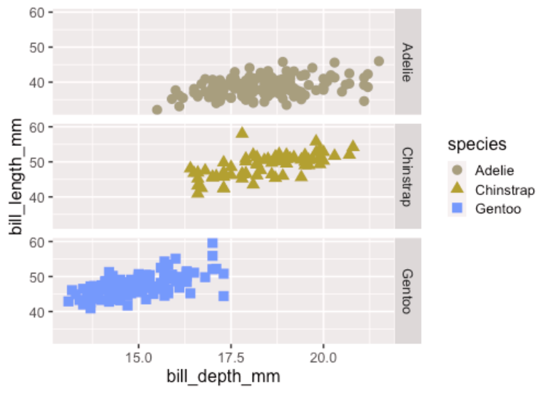
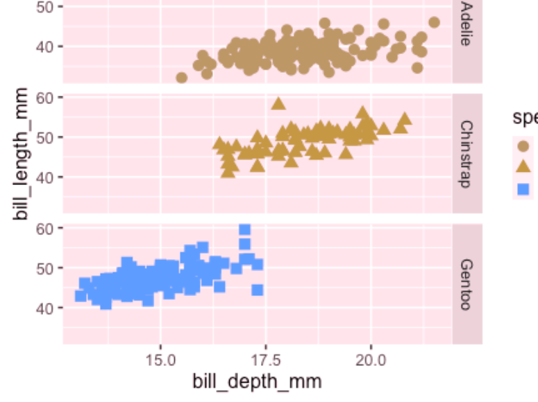
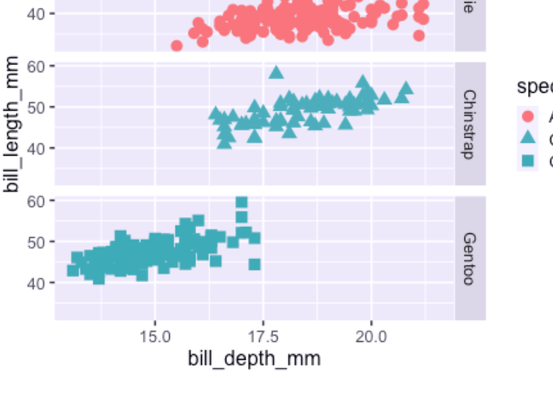

class: title-slide

```{r child = "../setup.Rmd"}
```

<br>
<br>
.right-panel[ 

# `r rmarkdown::metadata$title`
## `r rmarkdown::metadata$author`
]

---

class: middle

## Review

Quiz questions

---

class: middle

## Outline

- More ggplot

- Accessible Data Visualization


---


```{r echo = FALSE, message=FALSE}
xaringanExtra::use_panelset()
library(palmerpenguins)
library(tidyverse)
library(titanic)
library(janitor)
library(fivethirtyeight)
titanic <- titanic_train %>% 
  clean_names() %>% 
  select(survived, pclass, sex, age, fare, embarked) %>% 
  mutate(pclass = case_when(pclass == 1 ~ "First", 
                            pclass == 2 ~ "Second",
                            pclass == 3 ~ "Third"),
         embarked = case_when(embarked == "S" ~ "Southampton",
                              embarked == "C" ~ "Cherbourg",
                              embarked == "Q" ~ "Queenstown"),
         embarked = as.factor(embarked),
         sex = as.factor("sex"),
         survived = as.logical(survived))
```


---

class: middle 
 

.panelset[
.panel[

.panel-name[Plot]

```{r echo = FALSE, fig.align='center', warning = FALSE, fig.height=5}
ggplot(penguins,
       aes(x = bill_depth_mm,
           y = bill_length_mm,
           shape = species,
           color = species)) +
  geom_point(size = 4) 
```

]

.panel[

.panel-name[English]
- Using the `penguins` data,   
- Map `bill depth` to x-axis, `bill length` to y-axis, `species` to shape and color.
- Add a layer of points and set the size of the points to 4.
]

.panel[
.panel-name[R]
```{r eval = FALSE}
ggplot(penguins,
       aes(x = bill_depth_mm,
           y = bill_length_mm,
           shape = species,
           color = species)) +
  geom_point(size = 4) 
```

]

]


---

class: middle 

## Labs


.panelset[
.panel[

.panel-name[Plot]

```{r echo = FALSE, fig.align='center', warning = FALSE, fig.height=5}
ggplot(penguins,
       aes(x = bill_depth_mm,
           y = bill_length_mm,
           shape = species,
           color = species)) +
  geom_point(size = 4) +
  labs(x = "Bill Depth (mm)", #<<
       y = "Bill Length (mm)", #<<
       title = "Palmer Penguins") #<<
```

]

.panel[

.panel-name[English]
- Using the `penguins` data,   
- Map `bill depth` to x-axis, `bill length` to y-axis, `species` to shape.
- Add a layer of points and set the size of the points to 4.
- .highlight-text[Add labels to x-axis (Bill Depth(mm)), y-axis (Bill Length(mm)), and the title of the plot (Palmer Penguins).]


.panel[
.panel-name[R]
```{r eval = FALSE}
ggplot(penguins,
       aes(x = bill_depth_mm,
           y = bill_length_mm,
           shape = species,
           color = species)) +
  geom_point(size = 4) +
  labs(x = "Bill Depth (mm)", #<<
       y = "Bill Length (mm)", #<<
       title = "Palmer Penguins") #<<
```

]

]


]

---

class: middle

.left-panel[
```{r eval = FALSE}
ggplot(penguins,
       aes(x = bill_depth_mm,
           y = bill_length_mm,
           shape = species,
           color = species)) +
  geom_point() +
  labs(x = "Bill Depth (mm)", 
       y = "Bill Length (mm)", 
       title = "Palmer Penguins") +
  theme_bw() #<<
  
```

]

.right-panel[
```{r echo = FALSE, fig.height=5, warning = FALSE}
ggplot(penguins,
       aes(x = bill_depth_mm,
           y = bill_length_mm,
           shape = species,
           color = species)) +
  geom_point() +
  labs(x = "Bill Depth (mm)",
       y = "Bill Length (mm)",
       title = "Palmer Penguins") +
  theme_bw()
```

]

---

class: middle

## Themes

.panelset[


.panel[

.panel-name[`theme_gray()`]

```{r echo = FALSE, fig.height=4, fig.align='center', warning = FALSE}
ggplot(penguins,
       aes(x = bill_depth_mm,
           y = bill_length_mm,
           shape = species,
           color = species)) +
  geom_point() +
  labs(x = "Bill Depth (mm)",
       y = "Bill Length (mm)",
       title = "Palmer Penguins") +
  theme_gray()
```

]

.panel[

.panel-name[`theme_bw()`]

```{r echo = FALSE, fig.height=4, fig.align='center', warning = FALSE}
ggplot(penguins,
       aes(x = bill_depth_mm,
           y = bill_length_mm,
           shape = species,
           color = species)) +
  geom_point() +
  labs(x = "Bill Depth (mm)",
       y = "Bill Length (mm)",
       title = "Palmer Penguins") +
  theme_bw()
```

]

.panel[

.panel-name[`theme_classic()`]

```{r echo = FALSE, fig.height=4, fig.align='center', warning = FALSE}
ggplot(penguins,
       aes(x = bill_depth_mm,
           y = bill_length_mm,
           shape = species,
           color = species)) +
  geom_point() +
  labs(x = "Bill Depth (mm)",
       y = "Bill Length (mm)",
       title = "Palmer Penguins") +
  theme_classic()
```

]

.panel[

.panel-name[`theme_dark()`]

```{r echo = FALSE, fig.height=4, fig.align='center', warning = FALSE}
ggplot(penguins,
       aes(x = bill_depth_mm,
           y = bill_length_mm,
           shape = species,
           color = species)) +
  geom_point() +
  labs(x = "Bill Depth (mm)",
       y = "Bill Length (mm)",
       title = "Palmer Penguins") +
  theme_dark()
```

]

.panel[
.panel-name[`theme_minimal()`]

```{r echo = FALSE, fig.height=4, fig.align='center', warning = FALSE}
ggplot(penguins,
       aes(x = bill_depth_mm,
           y = bill_length_mm,
           shape = species,
           color = species)) +
  geom_point() +
  labs(x = "Bill Depth (mm)",
       y = "Bill Length (mm)",
       title = "Palmer Penguins") +
  theme_minimal()
```

]


.panel[
.panel-name[`theme_void()`]

```{r echo = FALSE, fig.height=4, fig.align='center', warning = FALSE}
ggplot(penguins,
       aes(x = bill_depth_mm,
           y = bill_length_mm,
           shape = species,
           color = species)) +
  geom_point() +
  labs(x = "Bill Depth (mm)",
       y = "Bill Length (mm)",
       title = "Palmer Penguins") +
  theme_void()
```

]
]

---

class: middle 

.left-panel[

```{r eval = FALSE}
ggplot(penguins,
       aes(x = bill_depth_mm,
           y = bill_length_mm,
           shape = species,
           color = species)) +
  geom_point() +
  labs(x = "Bill Depth (mm)", 
       y = "Bill Length (mm)", 
       title = "Palmer Penguins") +
  theme_bw() +
  theme(text = element_text(size=20)) #<<
  
```

]

.right-panel[

```{r echo = FALSE, fig.height=5, warning = FALSE}
ggplot(penguins,
       aes(x = bill_depth_mm,
           y = bill_length_mm,
           shape = species,
           color = species)) +
  geom_point() +
  labs(x = "Bill Depth (mm)",
       y = "Bill Length (mm)",
       title = "Palmer Penguins") +
  theme_bw() +
  theme(text = element_text(size=20))
```
]


---

class: middle

```{r eval = FALSE}
?theme
```


---

class: middle 
 

.left-panel[

```{r eval = FALSE, fig.align='center', warning = FALSE, fig.height=5}
ggplot(penguins,
       aes(x = bill_depth_mm,
           y = bill_length_mm,
           shape = species,
           color = species)) +
  geom_point(size = 4) +
  facet_grid(.~species) #<<
```

]

.right-panel[
```{r echo = FALSE, fig.align='center', warning = FALSE, fig.height=5}
ggplot(penguins,
       aes(x = bill_depth_mm,
           y = bill_length_mm,
           shape = species,
           color = species)) +
  geom_point(size = 4) +
  facet_grid(.~species)
```
]

---

class: middle 
 

.left-panel[

```{r eval = FALSE, fig.align='center', warning = FALSE, fig.height=5}
ggplot(penguins,
       aes(x = bill_depth_mm,
           y = bill_length_mm,
           shape = species,
           color = species)) +
  geom_point(size = 4) +
  facet_grid(species~.) #<<
```

]

.right-panel[
```{r echo = FALSE, fig.align='center', warning = FALSE, fig.height=5}
ggplot(penguins,
       aes(x = bill_depth_mm,
           y = bill_length_mm,
           shape = species,
           color = species)) +
  geom_point(size = 4) +
  facet_grid(species~.)
```
]

---

class: middle

.left-panel[
```{r eval = FALSE}
ggplot(penguins,
       aes(x = bill_depth_mm,
           y = bill_length_mm)) +
  geom_point() +
  xlim(0, 30) + #<<
  ylim(0,70) #<<
  
```

]

.right-panel[
```{r echo = FALSE, fig.height=5, warning = FALSE}
ggplot(penguins,
       aes(x = bill_depth_mm,
           y = bill_length_mm)) +
  geom_point() +
  xlim(0, 30) +
  ylim(0,70)
```

]


---

class: middle

[Top Ten Dos and Don't for Charts and Graphs](https://guides.lib.uci.edu/datavis/do)

---

class: middle

Check out [the ggplot flipbook](https://evamaerey.github.io/ggplot_flipbook/ggplot_flipbook_xaringan.html#1) for some inspiration. 
Find your favorite new function/feature. 
Share it with your neighbor.


---

class: middle center inverse

.font75[Making Accessible Visualizations]

---

class: middle

[Color blindness simulation](https://www.color-blindness.com/coblis-color-blindness-simulator/): red-blind/protanopia

```{r echo=FALSE, out.width="60%"}

```

---

class: middle

[Color blindness simulation](https://www.color-blindness.com/coblis-color-blindness-simulator/): green-blind/deuteranopia

```{r echo=FALSE, out.width="60%"}

```


---

class: middle

[Color blindness simulation](https://www.color-blindness.com/coblis-color-blindness-simulator/): blue-blind/tritanopia

```{r echo=FALSE, out.width="60%"}

```
---

class: middle 

```{r}
palette.colors(palette = "Okabe-Ito")
```

[Okabe-Ito color palette](https://jfly.uni-koeln.de/color/) allows us to make figures that are colorblind friendly.
You can use the HEX code printed for selecting colors.
---

class: middle

.left-panel[
```{r eval = FALSE}
ggplot(penguins,
       aes(x = bill_depth_mm,
           y = bill_length_mm,
           shape = species,
           color = species)) +
  geom_point(size = 4) +
  facet_grid(species~.) +
  scale_color_manual(values = #<<
                      c("#E69F00", #<<
                        "#009E73", #<<
                        "#56B4E9")) #<<
  
```

]

.right-panel[
```{r echo = FALSE, fig.height=5, warning = FALSE}
ggplot(penguins,
       aes(x = bill_depth_mm,
           y = bill_length_mm,
           shape = species,
           color = species)) +
  geom_point(size = 4) +
  facet_grid(species~.) +
  scale_color_manual(values = 
                      c("#E69F00",
                        "#009E73",
                        "#56B4E9"))
```

]

---


class: middle 

## Detour: R Markdown chunk options

`r ''````{r, echo=TRUE, message=FALSE}
```
---


class: center middle 

## (some) Chunk Options in R Markdown

<table align = "center">

<tr>

<td>echo = FALSE</td>
<td>hides the code</td>

</tr>

<tr>

<td>message = FALSE</td>
<td>hides messages</td>

</tr>

<tr>

<td>warning = FALSE</td>
<td>hides warning</td>

</tr>

<tr>

<td>error = TRUE</td>
<td>renders despite errors and displays the error</td>

</tr>

<tr>

<td>cap = "Some figure caption"</td>
<td>creates a figure caption</td>

</tr>

<tr>

<td>alt = "Some alternate text for figure"</td>
<td>creates alternate text for figures</td>

</tr>


</table>


---

class: middle 

## Alternate Text

"Alt text" describes contents of an image. 
It is used in HTML pages such as the R Markdown outputs we have been writing. 
Screen-readers cannot read images but can read alt text.
Alt text has to be provided and cannot magically appear. 

---

---

class: middle

## Potential Content of Alternate Text for Data Visualization

1. Data source/frame
2. Variables and axes information including units
3. The plot type
4. The message that the plot conveys.

---

class: middle

Please complete the in-class activity provided to you in lecture notes.