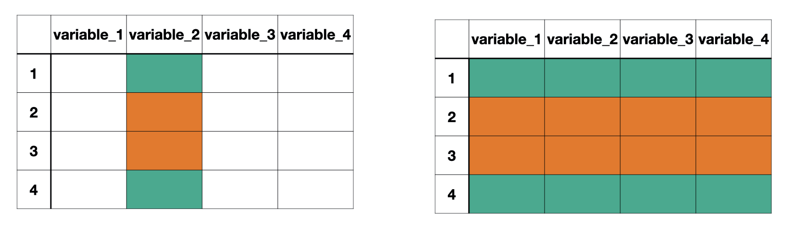

class: title-slide

```{r child = "../setup.Rmd"}
```

```{r echo = FALSE, message = FALSE}
library(tidyverse)
library(janitor)
options(scipen = 999)
```

<br>
<br>
.right-panel[ 

# `r rmarkdown::metadata$title`
## `r rmarkdown::metadata$author`
]

---

class: middle

## Review

Quiz  


---

class: middle

## Goals 

- Review aggregating data
- Aggregating group data
- Lots of data wrangling practice

---
class: middle

```{r echo = FALSE, message = FALSE}
lapd <- 
  read_csv(here::here("slides/data/Police_Payroll.csv")) %>% 
  janitor::clean_names() %>% 
  filter(year == 2018) %>% 
  select(job_class_title, 
         employment_type, 
         base_pay) %>% mutate(employment_type = as.factor(employment_type),
           job_class_title = as.factor(job_class_title),
           base_pay_level = case_when(
             base_pay < 0 ~ "Less than 0", 
             base_pay == 0 ~ "No Income",
             base_pay < 62474 & base_pay > 0 ~ "Less than Median, Greater than 0",
             base_pay > 62474 ~ "Greater than Median")) 
```


.pull-left[
## Data
Observations
]

.pull-left[
## Aggregate Data
Summaries of observations
]

---
class: inverse middle

.font75[Aggregating Categorical Data]

---

class: middle

Categorical data are summarized with **counts** or **proportions**

---

class: middle

```{r}
lapd %>% 
  count(employment_type)
```


---

class: middle

```{r}
lapd %>% 
  count(employment_type) %>% 
  mutate(prop = n/sum(n))
```


---

class: middle

## Mean


```{r}
summarize(lapd, 
          mean_base_pay = mean(base_pay))
```


---
class: middle

### Mean is not a good measure when the data are skewed

```{r echo = FALSE, message = FALSE, fig.height=6}
ggplot(lapd, aes(x = base_pay)) +
  geom_histogram(binwidth = 10000)
```


---

class: middle


## Median

.pull-left[
```{r}
summarize(lapd, 
          median(base_pay))
```
]

--

.pull-right[

```{r}
median(lapd$base_pay)
```

]

---

## Quantiles

```{r}
summarize(lapd, quantile(base_pay, c(0.25, 0.50, 0.75)))
```

```{r echo = FALSE}
q1 <- summarize(lapd, quantiles = quantile(base_pay, c(0.25))) %>% 
  pull()
```


We would expect 25% of the data to be less than `r q1`


---

class: middle

Recall that we use multiple functions such as `mean()` and `median` within the summarize function

```{r}
summarize(lapd,
          mean_base_pay = mean(base_pay),
          med_base_pay = median(base_pay))
```

---

class: inverse middle

.font75[Aggregating Data by Groups]

---

class: middle

`group_by()`

```{r echo = FALSE, out.width="80%", fig.align='center'}

```

`group_by()` separates the data frame by the groups. Any action following `group_by()` will be completed for each group separately.
---

class: middle

Q. What is the median salary for each employment type?

---

```{r}
lapd %>% 
  group_by(employment_type)
```

---

```{r}
lapd %>% 
  group_by(employment_type) %>% 
  summarize(med_base_pay = median(base_pay))
```

---

class: middle

We can also remind ourselves how many staff members there were in each group.

```{r}
lapd %>% 
  group_by(employment_type) %>% 
  summarize(med_base_pay = median(base_pay),
            count = n())
```

Note that `n()` does not take any arguments.

---

class: middle

Complete the questions provided to you in the lecture notes.