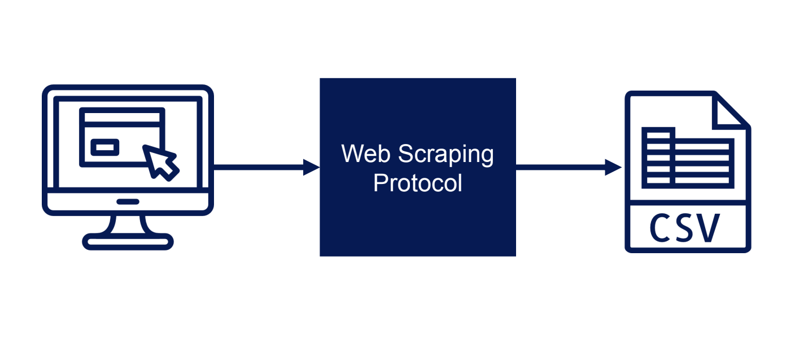
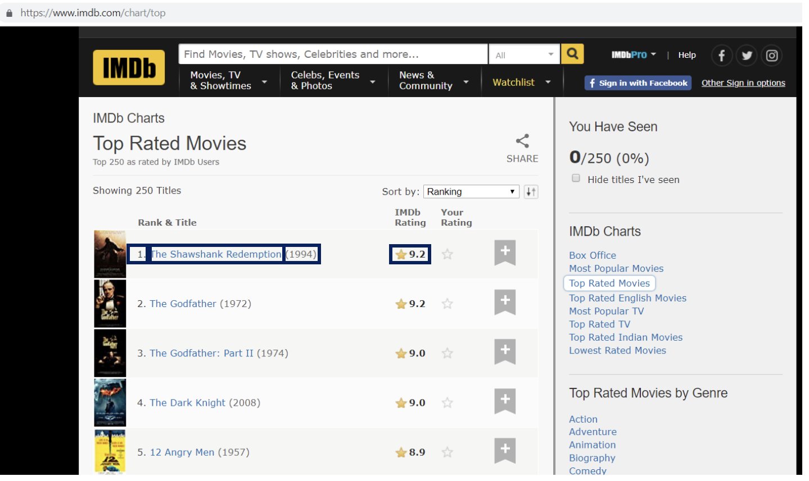
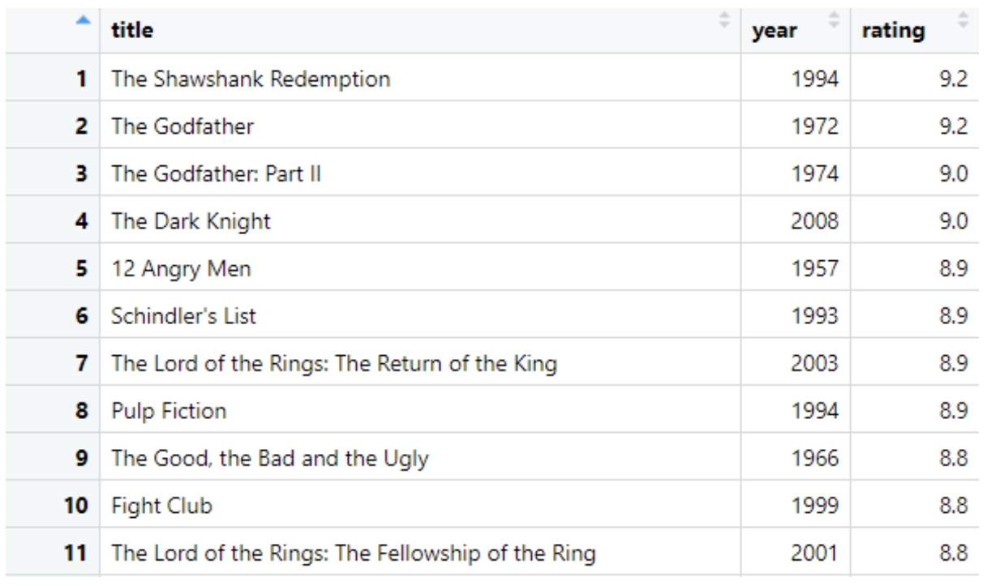
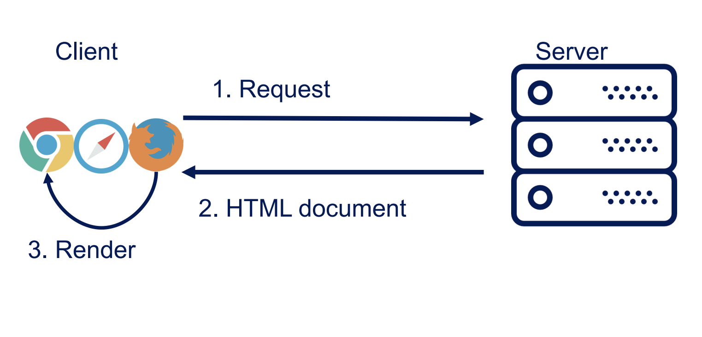
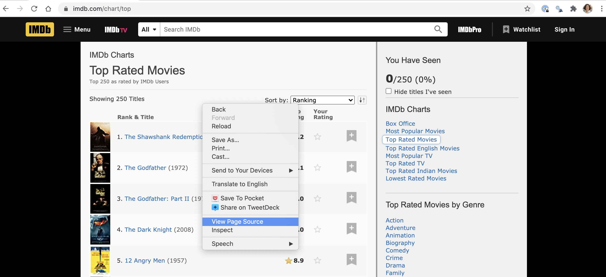
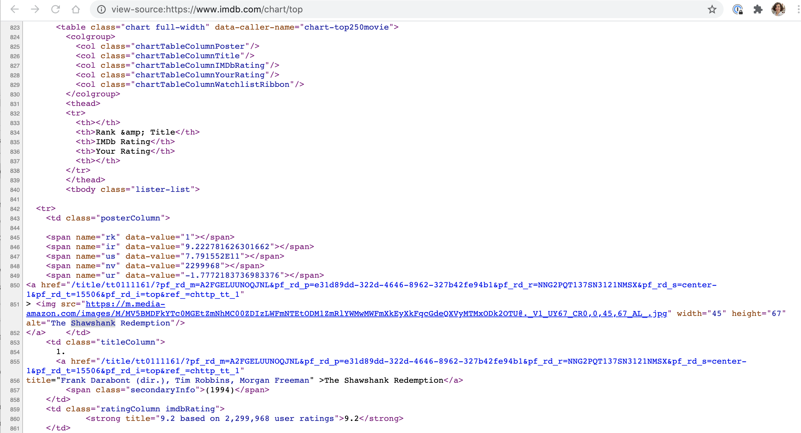
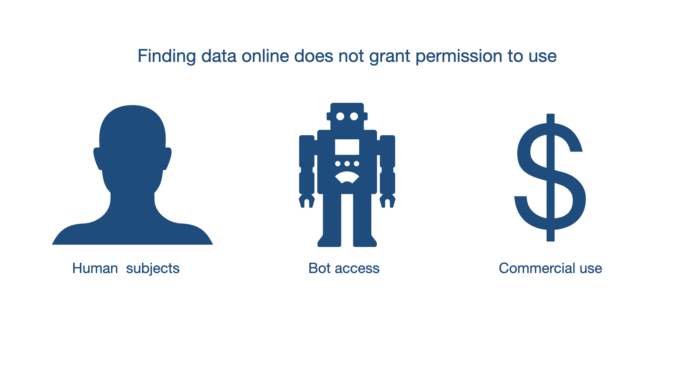

class: title-slide

```{r child = "../setup.Rmd"}
```

```{r echo = FALSE, message = FALSE}
library(tidyverse)
options(scipen = 999)
```

<br>
<br>
.right-panel[ 

# `r rmarkdown::metadata$title`
## `r rmarkdown::metadata$author`
]

---

class: middle

## Review

Quiz  
GitHub collaboration

---

class: middle

## Goals

- HTML & CSS
- Web scraping
- Considerations when working with web data

---


class: inverse middle 

.font75[**H**yper**t**ext **M**arkup **L**anguage]

---

class: center middle

## An ugly web page

```{r echo = FALSE, out.width="80%", fig.align='center'}
knitr::include_graphics("img/ugly-website.png")
```


---
class: center middle

### HTML document outline

<video width="80%" height="45%%" align = "center" controls>
  <source src="screencast/5-html-start.mp4" type="video/mp4">
</video>

---

class: center middle

### Paragraphs

<video width="80%" height="45%%" align = "center" controls>
  <source src="screencast/5-p-tag.mp4" type="video/mp4">
</video>

---

class: center middle

### Hyperlinks

<video width="80%" height="45%%" align = "center" controls>
  <source src="screencast/5-a-tag.mp4" type="video/mp4">
</video>
---

`<a href="https://www.r-project.org/">R</a>`

<br>

--

.pull-left[`<a> </a>`] .pull-right[HTML tag]

<br>

--

.pull-left[`href`] .pull-right[attribute (name)]

<br>

--

.pull-left[`https://www.r-project.org/`].pull-right[attribute (value)]

<br>

--

.pull-left[`R`] .pull-right[content]

---

class: center middle

### Spans

<video width="80%" height="45%%" align = "center" controls>
  <source src="screencast/5-span-tag.mp4" type="video/mp4">
</video>


---

class: inverse middle

.font75[**C**ascading **S**tyle **S**heets]


---
class: center middle

### Styling

<video width="80%" height="45%%" align = "center" controls>
  <source src="screencast/5-style-css.mp4" type="video/mp4">
</video>


---
class: center middle

```{r echo = FALSE, out.width="80%"}
knitr::include_graphics(here::here("slides/week05/img/html-tree.jpeg"))
```

---

class: inverse middle 

.font75[Web scraping]

---


class: center middle

[SelectorGadget](https://chrome.google.com/webstore/detail/selectorgadget/mhjhnkcfbdhnjickkkdbjoemdmbfginb?hl=en)

<hr>

[IMDB 250 Top Rated Movies](https://www.imdb.com/chart/top)

---

class:middle

```{r echo = FALSE, fig.align='center',out.width="80%"}

```

---

class: middle

```{r echo = FALSE, fig.align='center',out.width="80%"}

```

---

class: middle

```{r echo = FALSE, fig.align='center',out.width="80%"}

```

---

class: middle

```{r echo = FALSE, fig.align='center',out.width="80%"}

```

---

class: middle

```{r echo = FALSE, fig.align='center',out.width="80%"}

```

---

class: middle

```{r echo = FALSE, fig.align='center',out.width="80%"}

```


---

class: center middle

<video width="80%" height="45%%" align = "center" controls>
  <source src="screencast/5-selector-gadget.mp4" type="video/mp4">
</video>

---

class: middle

```{r echo = FALSE, fig.align='center',out.width="80%"}

```

---

class: middle

```{r echo = FALSE, fig.align='center',out.width="20%"}
knitr::include_graphics("img/rvest-logo.png")
```

`read_html()` - reads an html page.  
`html_nodes()`  - extracts the html nodes.  
`html_text()` - extracts the text of the node.  
`html_attr()` - extracts the attribute

---

class: middle

## Load packages 

```{r message = FALSE}
library(rvest)          
library(tidyverse)      
```

---

class: middle

### Check if a bot has permisson to access page

```{r}
robotstxt::paths_allowed("http://www.imdb.com")
robotstxt::paths_allowed("http://www.facebook.com")
```

---

class: middle

# Read the entire page

```{r}
page <- read_html("http://www.imdb.com/chart/top")

page
```

---
class: inverse middle

.font50[Scrape titles]

---

class: middle

```{r}
page %>%
  html_nodes(".titleColumn a")
```

---

class: middle

```{r}
page %>%
  html_nodes(".titleColumn a") %>% 
  html_text()
```

---

class: middle

```{r}

titles <- page %>%
  html_nodes(".titleColumn a") %>% 
  html_text()
```

---

class: middle

```{r}
str(titles)
```

---

class: inverse middle

.font50[Scrape years]

---

class: middle

```{r}
page %>% 
  html_nodes(".secondaryInfo") %>% 
  html_text()
```

---

class: middle

```{r}
page %>% 
  html_nodes(".secondaryInfo") %>% 
  html_text() %>% 
  str_remove("\\(") %>%                
  str_remove("\\)") %>%               
  as.numeric()
```


---

class: middle

```{r}
years <- 
  page %>% 
  html_nodes(".secondaryInfo") %>% 
  html_text() %>% 
  str_remove("\\(") %>%                
  str_remove("\\)") %>%               
  as.numeric()
```


---


class: middle inverse

.font50[Scrape ratings]

---

class: middle

```{r}
ratings <- page %>%
  html_nodes("strong") %>%
  html_text() %>%
  as.numeric()
```

---

class: middle

```{r}
imdb_top_250 <- tibble(
  title = titles, 
  year = years, 
  rating = ratings
)
```

---
class: middle

```{r}
imdb_top_250 %>%
  group_by(year) %>%
  summarize(avg_rating = mean(rating)) %>% 
  arrange(desc(avg_rating))
```

---

class: middle

```{r}
imdb_top_250 %>% 
  filter(year == 1972)
```

---


class: inverse middle 

.font75[Considerations about web data]

---

class: middle

```{r echo = FALSE, fig.align='center', out.width="95%"}

```

---

class: middle

## Do you need all that data at that speed?

**Sampling** rather than scraping all of the data may be an option.

--

You may end up with `HTTP Error 429 (Too many requests)`. In this case you may want to slow down your requests per a given time interval. 

```{r}
scrape_movie <- function(movie_url) {
  Sys.sleep(runif(1))
  #### Remaining code of the function  
}
```

Before scraping each movie's page this would make system to sleep for a random number of seconds between 0 and 1 second. 

---

class: middle

## Write your data (if possible)

- Data online are not static.

- Web pages change structures.

- Only way of reproducing the same results may be from the `csv` files that you write.

---

class: middle

## Optional

Make use of `beepr::beep()`, this way when your code finishes running, you will be notified.
