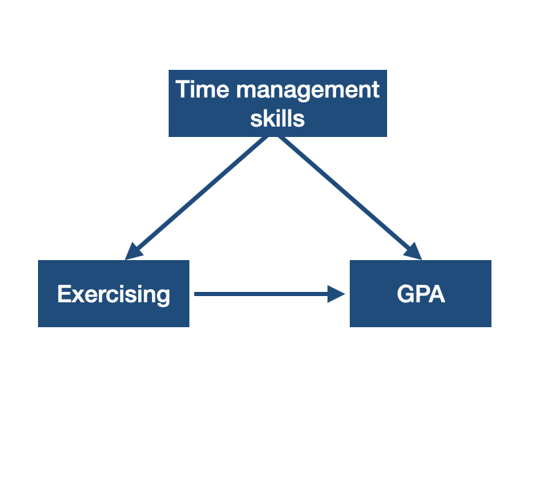
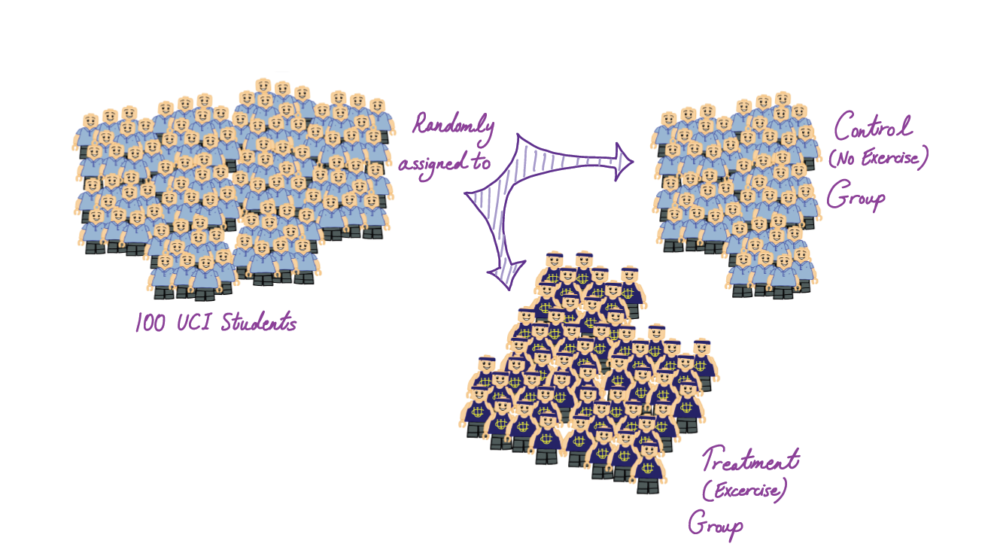
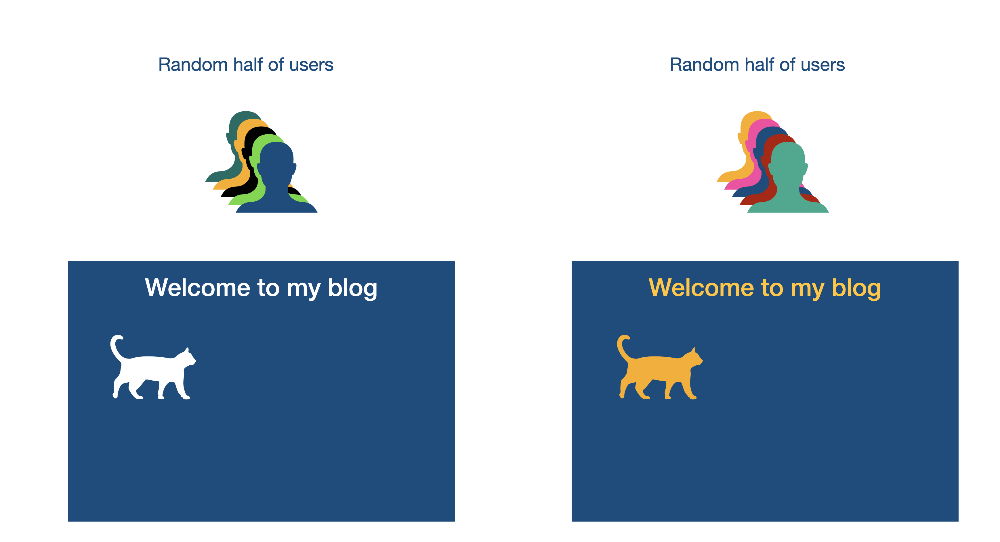

class: title-slide

```{r child = "../setup.Rmd"}
```

```{r echo = FALSE, message = FALSE}
library(tidyverse)
library(gridExtra)
options(scipen = 999)
```

<br>
<br>
.right-panel[ 

# `r rmarkdown::metadata$title`
## `r rmarkdown::metadata$author`
]

---

class: middle

## Review

Quiz  
Homework

---

class: middle

## Goals


- Sample vs. Population
- Study Design


---

class: middle

## Research question

Do UCI students who exercise regularly have higher GPA?

---

class: middle

## Population

Each research question aims to examine a __population__. 

Population for this research question is UCI students.


---

class: middle

## Survey

- Do you exercise at least once every week?

- What is your GPA?

---

class: middle

## Sampling

When it is impossible or costly to get information from all of the __population__ we take a __sample__. 

Since it would be almost impossible to give the survey to ALL UCI students, we can give it to a sample of students. 

---

class: middle

## Convenience Sampling

- Stand in front of Langson Library
- Give the survey to 100 UCI students


--

This could introduce __bias__. It is possible that those in front of the library

- may study more and thus may have higher GPA.
- may be more active than those who study at home/dorm.

---

class: middle

## Simple Random Sample

The goal is to have a sample that is __representative__ of the population.

We can use simple random sampling to select the sample. Using simple random sampling technique anybody in the population has an equal chance of being selected to the sample. 

[Random Number Generator](https://www.google.com/search?channel=cus2&client=firefox-b-1-d&q=random+number+generator)


---

class: middle


## Simple Random Sample

The researcher can 
- reach out to the registrar to get student emails. 
- randomly select 100 students.
- email them the survey

All of the 100 selected students respond.

Population: All UCI students  
Sample: 100 students who have responded

---

class: middle


## Nonresponse Bias

It is unlikely that 100 students will respond. Assume that 86 respond. 

It is possible that those 14 who did not respond

- may be busy exercising and did not have the time to respond.
- may be busy studying and did not have the time to respond. 

This kind of bias is called __nonresponse bias__.

---

class: middle

## Example 

A scientist is interested in counting the number of different species of bacteria in San Diego Creek. She takes a bucket of water from San Diego Creek and counts the different specifies of bacteria. The bacteria in the bucket make up the __sample__ and the bacteria in San Diego Creek make up the __population__. Note that this is not a simple random sample!

---

class: middle


## Example

In customer satisfaction surveys, the intent is to get opinion on all customers (population). The sample is based on self-selection. Those who want to provide opinion provide it. Not a random sample!


```{r fig.align='center', out.width="40%", echo = FALSE}
knitr::include_graphics("https://cdn.pixabay.com/photo/2017/01/13/18/56/feedback-1977986_960_720.jpg")
```

Image by <a href="https://pixabay.com/users/Tumisu-148124/?utm_source=link-attribution&amp;utm_medium=referral&amp;utm_campaign=image&amp;utm_content=1977986">Tumisu</a> from <a href="https://pixabay.com/?utm_source=link-attribution&amp;utm_medium=referral&amp;utm_campaign=image&amp;utm_content=1977986">Pixabay</a>

---

class: middle

## Practice

A cell phone factory wants to do quality control of their products to ensure that their customers do not get malfunctioning products. They randomly select 3% of the phones that they produce and manually check if there are any problems or not. All the cell phones in the world make up the population and the cell phones that this factory produces make up the sample. **True or False**?

---

class: middle

## Generalizibility 

Why do we care to have a sample that is **representative** of the population?

--

We want the findings of studies to be **generalizable** to the population.

---


class: middle inverse

.font75[Study Design]

---

class: middle


## Anecdotal Evidence

You know two left-handed artists, you conclude being left-handed makes someone be better in art.

We tend to remember unusual cases.

We need rigorously designed studies to make generalizations and to establish causal relationships.

---


class: center middle

Do UCI students who exercise regularly have higher GPA?


---


class: middle

## Observational Study

- There is no treatment/intervention.
- Causal relationships should not be made.

Even if we observe that UCI students who exercise regularly have higher GPA, we cannot conclude that exercising regularly increases GPA.

---

class: middle

## Relationship between two variables

If two variables are related to each other in some way we would call them __associated__.

If two variables are not related to each other in any way we would call them __independent__.

---

class: middle

## Relationship between two variables

When we examine the relationship between two variables, we often want to know if the relationship between them is causal. In other words, does one variable cause the other? For instance, is exercising the reason for higher GPA? We don't know!

When we suspect that two variables have a causal relationship we can say

The __explanatory variable__ (e.g. exercising) might causally affect the __response variable__ (e.g. GPA).

--

Relationship between two variables does not imply one causes the other. 


---

class: middle

## Relationship between two variables

Explanatory variables are denoted by $x$ and the response variable is denoted by $y$. You can remember this from e**X**planatory variable is $x$. Exercising may e**X**plain high GPA. 

---

class: middle

```{r echo = FALSE, fig.align='center', out.width='50%'}

```

--

A __confounding variable__ (e.g. time management skills) has a correlation with the the explanatory and the response variable.

---

class: center middle


~~Do UCI students who exercise regularly have higher GPA?~~

Does exercising regularly increase GPA for UCI students?

---
## Experiment Design

```{r echo=FALSE, out.width='80%', fig.align='center'}

```

.footnote[Image Copyright Derenik Haghverdian. Used with permission.]


---

class: center middle

In __experiments__, researchers assign cases to treatments/interventions.

---

class: center middle

In __randomized experiments__, researchers randomly assign cases  to treatments/interventions. In order to establish causal link between variables, we need randomized experiments. 

---

class: middle

## Blocking

A doctor has developed a drug called drug `i.d.s.` to treat some disease. She wants to know if patients who take drug `i.d.s.` is free of the disease for at least a year.

--

The doctor suspects that the drug may affect adults and kids differently.

--

If researchers suspect that the an additional variable that may influence the response variable then they may use __blocks__.

---

class: middle

## Blocking


```{r echo=FALSE, out.width='80%', fig.align='center'}
knitr::include_graphics('img/blocking.png')
```

.footnote[Image Copyright Federica Ricci. Used with permission.]


---

class: middle

### A/B testing 

- A/B testing is a randomized experiment that compares two versions (A and B) of a single variable. 

- It is commonly used on measuring online activities such as revenue per user, click through rates for online ads, number of returning users.

--

```{r echo = FALSE, fig.align='center', out.width='50%'}

```

---

class: inverse middle

.font75[More vocabulary about experiments]


---

class: center middle

A __placebo__ is a fake treatment. If a patient shows an improvement by taking a placebo then this is called a __placebo effect__.

---

class: center middle

In __blind__ studies, patients do not know what treatment they receive. In __double blind__ studies patients who receive and the doctors who provide the treatment do not know the type of the treatment. 

---

class: center middle

[Institutional Review Board](https://research.uci.edu/compliance/human-research-protections/index.html)

---

class: middle

## Random Sampling vs. Random Assignment

- Random sampling is used to select the sample from the population randomly. Random sampling allows for findings to be generalized to the population.

- Random assignment is used to put participants to treatment/intervention groups randomly in experiments. Random assignment allows us to make causal relationships.

---


class: inverse middle

.font75[If there was no variance there would be no statistics.]


---

## What if?

- We want to understand average number of sleep Irvine residents get.  What if everyone in Irvine slept 8 hours every night? (`sleep` = {8, 8,..., 8})

--

- We want to predict who will graduate college. What if everyone graduated college? (`graduate` = {TRUE, TRUE,..., TRUE})

--

- We want to understand if Android users spend more time on their phones when compared to iOS users. What if everyone spent 3 hours per day on their phones? (`time` = {3, 3,..., 3}, `os` = {Android, Android, .... iOS})

--

- We want to understand, if birth height and weight are positively associated in babies. What if every baby was 7.5 lbs? (`weight` = {7.5, 7.5,..., 7.5}, `height` = {20, 22,..., 18})

---

class: middle

In all this fake scenarios there would be no **variance** in `sleep`, `graduate`, `time`, `weight`. These variables would all be constants thus would not even be a **vari**able.

---

class: middle

.font50[Things vary. We use statistics to understand **how** variables vary and often we want to know **how** they **covary** with other variables. ] 

---

class: middle 

Consider Dr. Dogucu teaching three classes. All of these classes have 5 students. Below are midterm results from these classes. Which of the classes have a higher variance?

Class 1: 80 80 80 80 80  
Class 2: 76 78 80 82 84  
Class 3: 60 70 80 90 100  

--

All of these classes have a mean of 80 points. But the data differ! In order to explain how these are different we examine how far off each observed value is from the mean on "average". In class 1 all students are at the mean value so there is no variance. Class 2 students deviate from the mean slightly on "average". Class 3 has the highest deviation from the mean on "average". 


---

class: inverse middle

.font75[Calculating the Variance]

---

class: middle 

## The Mean

Consider the following data which represents the number of hours slept for 10 people who were surveyed.

$y_i = \{7, 7.5, 8, 5.5, 10, 7.2, 7, 8, 9, 8\}$
```{r}
y_i <- c(7, 7.5, 8, 5.5, 10, 7.2, 7, 8, 9, 8)
```


--

```{r}
mean(y_i)
```

$\bar y = 7.72 \text{ hr}$

---

class: middle 

## Sample Size

```{r}
length(y_i)
```

$n = 10$

--

$i = \{1, 2, ... n\}$

--

$i = \{1, 2, ... 10\}$

---

class: middle 


.pull-left[## Standard Deviation

```{r}
sd(y_i)
```

$s = 1.218195 \text{ hr}$

]

.pull-right[## Variance

```{r}
var(y_i)
```

$s^2 = 1.484 \text{ hr}^2$

]

---
class: middle 

<br>
<br>

$n = 10$, $\bar y = 7.72 \text{ hr}$, $s = 1.218195 \text{ hr}$

Among 10 people the average number of sleep was 7.72 hours. However, everybody did not sleep 7.72 hours. There was deviation from the mean. The standard deviation from the mean was 1.218195 hours. The variance is the squared standard deviation which was $1.484 \text{ hr}^2$. 

---

class: inverse middle

.font50[How did R calculate the variance?]

---

class: middle 

#### Standard deviation and Variance


<table align = "center">
<thead>

<th>y<sub>i</sub> </th> <th>  y<sub>i</sub> - y&#772 </th> <th> (y<sub>i</sub> - y&#772) <sup>2</sup></th>
</thead>

<tr> 
<td>5.5 </td> <td> 5.5-7.72 = -2.22 hr</td> <td> (-2.2 hr)<sup>2</sup> = 4.9284 hr <sup>2</sup> </td>
</tr>

<tr> 
<td>7 </td> <td> 7-7.72 = -0.72 hr</td> <td> (-0.72 hr)<sup>2</sup> = 0.5184 hr <sup>2</sup></td>
</tr>

<tr> 
<td>7 </td> <td> 7-7.72 = -0.72 hr</td> <td> (-0.72 hr)<sup>2</sup> = 0.5184 hr <sup>2</sup></td>
</tr>

<tr> 
<td>7.2 </td> <td> 7.2-7.72 = -0.52 hr</td> <td> (-0.52 hr)<sup>2</sup> = 0.2704 hr <sup>2</sup></td>
</tr>

<tr> 
<td>7.5 </td> <td> 7.5-7.72 = -0.22 hr</td> <td> (-0.22 hr)<sup>2</sup> = 0.0484 hr <sup>2</sup></td>
</tr>

<tr> 
<td>8 </td> <td> 8-7.72 = 0.28 hr</td> <td> (0.28 hr)<sup>2</sup> = 0.0784 hr <sup>2</sup></td>
</tr>

<tr> 
<td>8 </td>  <td> 8-7.72 = 0.28 hr</td> <td> (0.28 hr)<sup>2</sup> = 0.0784 hr <sup>2</sup></td>
</tr>

<tr> 
<td>8 </td> <td> 8-7.72 = 0.28 hr</td> <td> (0.28 hr)<sup>2</sup> = 0.0784 hr <sup>2</sup></td>
</tr>

<tr> 
<td>9 </td> <td> 9-7.72 = 1.28 hr</td> <td> (1.28 hr)<sup>2</sup> = 1.6384 hr <sup>2</sup></td>
</tr>

<tr> 
<td>10 </td> <td> 10-7.72 = 2.28 hr</td> <td> (2.28 hr)<sup>2</sup> = 5.1984 hr <sup>2</sup></td>
</tr>

</table>

---
class: middle 


## Total distance from the mean


$\Sigma_{i = 1}^{n} (y_i - \bar y )^2 =$

$4.9284 + 0.5184 + 0.5184 + 0.2704 + 0.0484 +$ 
$0.0784 + 0.0784 + 0.0784+ 1.6384 + 5.1984 = 13.356 \text{ hr}^2$

---
class: middle 


## Sample variance

<br>    
.formula[

$$s^2 = \frac{\Sigma_{i = 1}^{n} (y_i - \bar y )^2}{n-1}$$ 

]

<br>

$$s^2= \frac{13.356}{10-1} = 1.484\text{ hr}^2$$

---

class: middle 

## Notation

<table align ="center">

<thead>
<th> </th>
<th>Sample Statistic</th>
<th>Population Parameter</th>
</thead>

<tr>
<td>Mean</td>
<td> y&#772; </td>
<td> &mu;</td>

</tr>

<tr>
<td> Standard Deviation </td>
<td> s </td>
<td> &sigma;</td>

</tr>

<tr>
<td> Variance </td>
<td> s<sup>2</sup> </td>
<td> &sigma;<sup>2</sup></td>

</tr>

</table>

Sample size is denoted by $n$.

---

```{r echo = FALSE, fig.align='center'}

p1 <- 
  ggplot(data = data.frame(x = c(0, 200)), 
         aes(x)) +
  stat_function(fun = dnorm, n = 1001, args = list(mean = 100, sd = 15)) + 
  ylab("") +
    labs(title = expression(paste(mu, "= 100,", " ", sigma, "= 15")))+
  theme_bw() +
  theme(axis.text.y = element_blank(),
        text = element_text(size = 20)) 

p2 <- 
  ggplot(data = data.frame(x = c(0, 200)), 
         aes(x)) +
  stat_function(fun = dnorm, n = 1001, args = list(mean = 100, sd = 30)) + 
  ylab("") +
    labs(title = expression(paste(mu, "= 100,", " ", sigma, "= 30")))+
  theme_bw() +
  theme(axis.text.y = element_blank(),
        text = element_text(size = 20)) 

p3 <- 
  ggplot(data = data.frame(x = c(0, 200)), 
         aes(x)) +
  stat_function(fun = dnorm, n = 1001, args = list(mean = 90, sd = 15)) + 
  ylab("") +
  labs(title = expression(paste(mu, "= 90,", " ", sigma, "= 15")))+
  theme_bw() +
  theme(axis.text.y = element_blank(),
        text = element_text(size = 20)) 


p4 <- 
  ggplot(data = data.frame(x = c(0, 200)), 
         aes(x)) +
  stat_function(fun = dnorm, n = 1001, args = list(mean = 90, sd = 30)) + 
  ylab("") +
  labs(title = expression(paste(mu, "= 90,", " ", sigma, "= 30"))) +
  theme_bw() +
  theme(axis.text.y = element_blank(),
        text = element_text(size = 20)) 

grid.arrange(p1, p2, p3, p4, ncol = 2, nrow = 2)
```

---
class: inverse middle 

.font75[Writing Research Questions Using Notation]

---

class:center middle 

In statistics, we are interested in making an inference about population parameters. 

---


class: middle

`r fontawesome::fa(name = "search", fill = "#e56646")` **Research Question** Do UCI students sleep 8 hours on a typical night? 


--

`r fontawesome::fa(name = "table", fill = "#e56646")` **Variable** `sleep` (8,7,9,7.5, ...)

--

`r fontawesome::fa(name = "language", fill = "#e56646")` **Research Question Using Notation** $\mu \stackrel{?}{=} 8$


--

The parameter we want to infer about is **a single mean**.

---


## Side Note


If you want to type math notation correctly on Gradescope or R Markdown out correctly as $\mu$ then you can write 

```{r eval = FALSE}
$$\mu$$

```

The double dollar signs at the beginning and at the end let Gradescope know that you are writing a math equation.


---

class: middle 

`r fontawesome::fa(name = "search", fill = "#e56646")` **Research Question** Do the majority of Americans approve allowing DACA immigrants to become citizens?

--

`r fontawesome::fa(name = "table", fill = "#e56646")` **Variable** `approve` (yes, yes, yes, no, yes, no, no)

--

`r fontawesome::fa(name = "language", fill = "#e56646")` **Research Question Using Notation** $\pi \stackrel{?}{>} 0.5$ 

--

The parameter we want to infer about is **a single proportion**.

---

class: middle 

`r fontawesome::fa(name = "search", fill = "#e56646")` **Research Question** Is California March 2020 unemployment rate different than US March 2020 unemployment rate which is at 4.4%?

--

`r fontawesome::fa(name = "table", fill = "#e56646")` **Variable** `unemployed_CA` (no, no, yes, no, yes, no, no...)

--

`r fontawesome::fa(name = "language", fill = "#e56646")` **Research Question Using Notation** $\pi \stackrel{?}{=} 0.044$
--


The parameter we want to infer about is **a single proportion**.

---

class: middle 

`r fontawesome::fa(name = "search", fill = "#e56646")` **Research Question** Are there more STEM majors at UCI than non-STEM majors?

--

`r fontawesome::fa(name = "table", fill = "#e56646")` **Variable** `STEM` (TRUE, FALSE, FALSE, TRUE, FALSE, TRUE, TRUE...)

--

`r fontawesome::fa(name = "language", fill = "#e56646")` **Research Question Using Notation** $\pi_{STEM} \stackrel{?}{>} 0.5$


--

The parameter we want to infer about is **a single proportion**.

---

class: middle 

`r fontawesome::fa(name = "search", fill = "#e56646")` **RQ** Do STEM (s) majors have higher or lower (different) income after graduation when compared to non-STEM (n) majors?

--

`r fontawesome::fa(name = "table", fill = "#e56646")` **Variables** explanatory: `STEM` (TRUE, FALSE, FALSE, TRUE,...)  
response: `income`(40000, 20000, 65490, 115000,...)

--

`r fontawesome::fa(name = "language", fill = "#e56646")` **Research Question Using Notation** $\mu_{s} \stackrel{?}{=} \mu_{n}$ or $\mu_{s} - \mu_{n}  \stackrel{?}{=}0$ 

--

We want to infer about **difference of two means**.

---

class: middle

`r fontawesome::fa(name = "search", fill = "#e56646")` **RQ** Do Democrats and Republicans approve legal abortion at same rates?

--

`r fontawesome::fa(name = "table", fill = "#e56646")` **Variables** explanatory: `party` (D, D, R, R,...)  
response: `approve`(TRUE, FALSE, FALSE, TRUE,...)

--
`r fontawesome::fa(name = "language", fill = "#e56646")` **Research Question Using Notation** $\pi_{d} \stackrel{?}{=} \pi_{r}$ or $\pi_{d} -  \pi_{r} \stackrel{?}{=}0$ 


--

We want to infer about **difference of two proportions**.


---

class: middle center


In the next few lectures we will learn about the following in more detail.

<div align="center">

|                               | Parameter of Interest | Response              |Explanatory            |
|-------------------------------|-----------------------|-----------------------|-----------------------|
| Single Mean                   | $\mu$                 | Numeric               |
| Difference of Two Means       | $\mu_1 - \mu_2$       | Numeric               |Binary                 |
| Single Proportion             | $\pi$                 | Binary                |
| Difference of Two Proportions | $\pi_1 - \pi_2$       | Binary                |Binary                 |


A categorical variable with two levels is called a __binary__ variable.

---

class: middle 

Later on we will learn

<div align = "center">

| Parameter of Interest | Response              |Explanatory                |
|-----------------------|-----------------------|-----------------------    |
| $\beta_1$             | Numeric               | Categorical and/or Numeric|

---

class: middle

For final projects:

- identify the sample, population.
- type of study.
- start using notation.